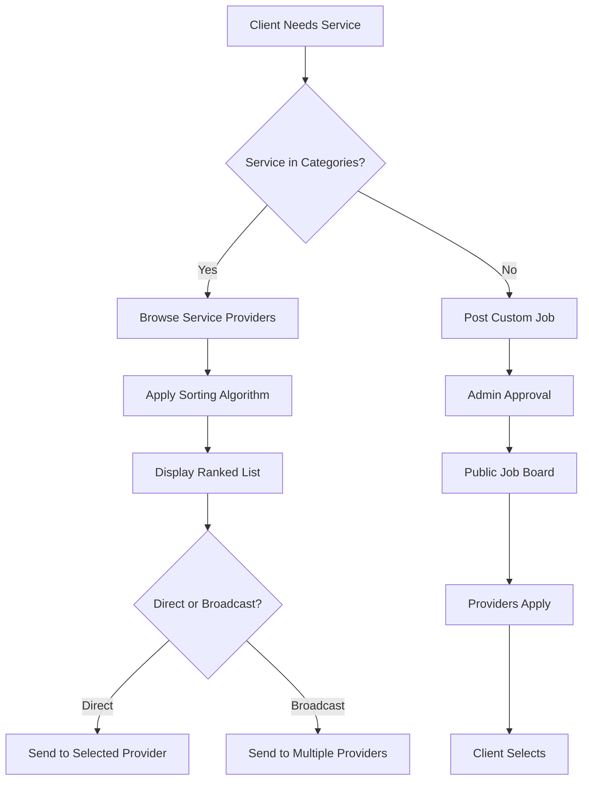
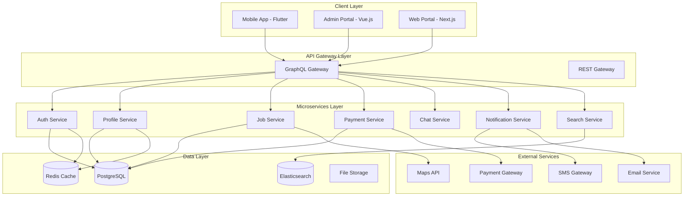

# **MOYA Application - Comprehensive Functional Requirements Document**

## **1. Introduction**

### **1.1 Purpose**
This document provides detailed functional requirements for the MOYA application, a digital marketplace connecting skilled service providers with job providers/clients in Addis Ababa, Ethiopia.

### **1.2 Scope**
MOYA facilitates local service transactions through a secure, level-based trust system with comprehensive profile management, job matching, contract handling, and admin oversight.

### **1.3 Key Objectives**
- Bridge service demand-supply gap in Addis Ababa
- Build trust through verification and rating systems
- Ensure secure transactions
- Provide robust admin controls
- Create sustainable revenue through commissions

---

## **2. User Authentication & Profile Management**

### **2.1 Authentication System**
```
Flow: Sign Up → Verification → Profile Setup → Activation
```

#### **2.1.1 Registration Methods**
- **Phone Number** (Primary - Ethiopian format: +251-9XXXXXXXX)
- **Email** (Secondary)
- **Social Login** (Google, Apple - optional)
- **Enterprise Registration** (Companies)

#### **2.1.2 Verification Process**
```javascript
// OTP Verification Flow
1. User enters phone/email
2. System sends 6-digit OTP via SMS/Email
3. User enters OTP (valid for 10 mins)
4. On success → Profile type selection
5. On failure (3 attempts) → 30-min cooldown
```

#### **2.1.3 Two-Factor Authentication (Optional)**
- Enabled via Settings
- Methods: SMS OTP, Authenticator App
- Required for: Large transactions, profile changes

### **2.2 Profile Type Selection**
```
User Types:
1. Service Provider (Individual/Company)
2. Job Provider (Individual/Company)
3. Hybrid (Both roles - can switch)
```

### **2.3 Service Provider Profile Management**

#### **2.3.1 Profile Completion Algorithm**
```python
class UserLevelSystem:
    LEVELS = {
        'Bronze': 0-100 points,
        'Silver': 101-300 points,
        'Gold': 301-600 points,
        'Platinum': 601-1000 points,
        'Diamond': 1000+ points
    }
    
    POINT_SYSTEM = {
        'phone_verified': 10,
        'email_verified': 10,
        'profile_photo': 20,
        'dob_added': 5,
        'id_verified': 50,        # National ID/Passport
        'license_verified': 75,   # Business license
        'skills_certified': 30,   # Per certificate
        'portfolio_link': 15,     # Per link
        'payment_method_added': 20,
        'first_job_completed': 100,
        'rating_4+': 25,          # Per job
        'premium_subscription': 150
    }
```

#### **2.3.2 Required Information**
1. **Basic Info**: Name, Phone, Email
2. **Service Selection**: Choose from admin-defined categories
3. **Work Locations**: 
   - Max 3 preferred areas
   - GPS coordinates optional
4. **Pricing Setup**:
   - Hourly/Daily/Project-based rates
   - Minimum charge
   - Travel fees (per km)
5. **Availability**:
   - Working hours
   - Days available
   - Emergency service flag

#### **2.3.3 Verification Tiers**
```
Tier 1: Basic (Phone + Email) → Can accept small jobs
Tier 2: Verified (ID + Photo) → Higher visibility
Tier 3: Certified (Skills + License) → Premium badge
Tier 4: Premium (Subscription) → Top priority
```

#### **2.3.4 Portfolio Management**
- Upload certificates (max 5)
- Previous work photos (max 20)
- External links (LinkedIn, website, etc.)
- Client testimonials (verified jobs only)

### **2.4 Job Provider Profile Management**

#### **2.4.1 Company Registration Process**
```javascript
// Company Registration Flow
1. Select "Register as Company"
2. Choose: Business/Individual
3. Provide:
   - Company name
   - TIN (Tax Identification Number)
   - Business license number
   - Registration documents upload
   - Authorized representative details
4. Verification by admin (24-48 hours)
5. Multi-user access setup (optional)
```

#### **2.4.2 Trust Level System**
```
Trust Score Factors:
- Payment method verified: +30
- Company verified: +100
- Prompt payment history: +10 per job
- No disputes: +5 per month
- Premium subscription: +50
```

#### **2.4.3 Payment Setup**
- Bank account verification (micro-deposit)
- Mobile money (Telebirr, M-Pesa)
- Credit/Debit cards
- Wallet top-up option

### **2.5 Hybrid Account Management**
- Users can switch between modes
- Separate profiles for each role
- Combined trust score
- Unified wallet

---

## **3. Service Category Management**

### **3.1 Hierarchical Structure**
```
Level 1: Category (Construction)
Level 2: Sub-category (Plumbing)
Level 3: Service (Pipe Installation)
Level 4: Specialization (PVC, Copper, etc.)
```

### **3.2 Category Attributes**
- Base price range
- Required certifications
- Insurance requirements
- Commission rates (per category)
- Approval workflow

### **3.3 Dynamic Management**
- Admin can add/disable categories
- Service providers can suggest new categories
- Trending categories highlighted
- Seasonal categories (e.g., AC repair in summer)

---

## **4. Job Posting & Contract Management**

### **4.1 Job Discovery Flow**


### **4.2 Provider Ranking Algorithm**
```python
def rank_providers(providers, client_location, job_requirements):
    scores = []
    
    for provider in providers:
        score = 0
        
        # 1. Proximity (40%)
        distance = calculate_distance(provider.location, client_location)
        proximity_score = (1 - min(distance/50, 1)) * 40  # Max 50km
        
        # 2. User Level (25%)
        level_multiplier = {
            'Bronze': 0.5,
            'Silver': 0.7,
            'Gold': 0.85,
            'Platinum': 1.0,
            'Diamond': 1.2
        }
        level_score = level_multiplier[provider.level] * 25
        
        # 3. Earnings/Reputation (20%)
        reputation_score = min(provider.total_earnings / 100000, 1) * 20
        
        # 4. Rating (15%)
        rating_score = (provider.avg_rating / 5) * 15
        
        # 5. Response Time Bonus (up to 10 bonus)
        response_bonus = 10 - min(provider.avg_response_time/60, 10)
        
        total = proximity_score + level_score + reputation_score + rating_score + response_bonus
        scores.append((provider, total))
    
    return sorted(scores, key=lambda x: x[1], reverse=True)
```

### **4.3 Invitation System**
#### **4.3.1 Direct Invitation**
- Client selects specific provider
- Custom message option
- Rate negotiation window (24 hours)
- Auto-decline if no response

#### **4.3.2 Broadcast Invitation**
- Send to up to 5 providers simultaneously
- First to accept gets the job
- Others notified of job taken
- Time limit: 4 hours

### **4.4 Contract Types**
```
1. Blocked Payment (Escrow)
   - Client deposits to MOYA
   - Provider starts work
   - Client approves completion
   - MOYA releases payment (minus commission)
   
2. Direct Payment
   - Client pays provider directly
   - Still tracked in system
   - Lower commission (5%)
   - Higher risk for provider
   
3. Milestone-based
   - Multiple payments at milestones
   - Each milestone requires approval
   - Suitable for large projects
```

### **4.5 Contract Workflow**
```javascript
// Contract State Machine
States: {
    DRAFT: 'Initial contract created',
    SENT: 'Sent to provider',
    REVIEW: 'Provider reviewing',
    NEGOTIATION: 'Terms being negotiated',
    ACCEPTED: 'Both parties accepted',
    ACTIVE: 'Work in progress',
    MILESTONE_REQUEST: 'Payment milestone requested',
    MILESTONE_APPROVED: 'Milestone payment released',
    COMPLETION_REQUESTED: 'Provider marks as complete',
    CLIENT_REVIEW: 'Client reviewing work',
    COMPLETED: 'Job finished, payment released',
    DISPUTED: 'Conflict raised',
    CANCELLED: 'Job cancelled',
    REFUNDED: 'Payment refunded'
}
```

### **4.6 Payment Escrow System**
1. **Funds Locking**: Client payment held in MOYA wallet
2. **Release Triggers**:
   - Automatic: 48 hours after client approval
   - Manual: Client approves immediately
   - Dispute: Admin mediation required
3. **Commission Deduction**: 10% automatically deducted
4. **Provider Payout**: 
   - Daily batch processing
   - Bank transfer/Mobile money
   - Minimum withdrawal: 100 ETB

### **4.7 Custom Job Posting**
- For services not in categories
- Detailed description required
- Budget range
- Timeline
- Admin approval required (spam prevention)
- Becomes public on job board
- Providers can apply with bids

---

## **5. In-App Messaging System**

### **5.1 Features**
- Real-time chat
- File sharing (images, PDFs - max 10MB)
- Voice messages
- Read receipts
- Typing indicators
- Message history (6 months retention)

### **5.2 Smart Messaging**
- Auto-suggest contract terms
- Price negotiation templates
- Location sharing
- Meeting scheduling
- Important messages flagged

### **5.3 Security**
- End-to-end encryption for sensitive data
- Report abusive messages
- Automatic spam filtering
- Admin access for disputes

---

## **6. Notification System**

### **6.1 Notification Types**
#### **6.1.1 Transactional**
- Account verification OTP
- Password reset
- Payment confirmations
- Contract updates

#### **6.1.2 Job-related**
- New job invitations ✓
- Contract acceptance/rejection
- Milestone approvals
- Job completion requests
- Payment releases

#### **6.1.3 Communication**
- New messages
- Unread reminders
- Meeting reminders

#### **6.1.4 System**
- Profile verification status
- Account warnings/suspensions
- Policy updates
- New features

#### **6.1.5 Marketing** (Opt-in)
- Job suggestions
- Category promotions
- Success stories

### **6.2 Delivery Channels**
```
Priority Matrix:
High Urgency: SMS + Push + In-App
Medium: Push + In-App
Low: In-App only
```

### **6.3 Notification Settings**
- Per-channel preferences
- Quiet hours (10 PM - 7 AM)
- Category-based muting
- Bulk notification control

### **6.4 Additional Notifications Needed**
1. **Geo-fence alerts**: Provider near job location
2. **Deadline reminders**: 24h/12h/1h before deadline
3. **Payment reminders**: Invoice due
4. **Review reminders**: After job completion
5. **Security alerts**: New device login
6. **Capacity alerts**: Too many active jobs
7. **Weather alerts**: Impact on outdoor jobs
8. **System maintenance**: Scheduled downtimes

---

## **7. Settings & Preferences**

### **7.1 Account Settings**
- Profile visibility (Public/Private)
- Contact preferences
- Language (Amharic/English)
- Currency (ETB)
- Distance units (km/miles)

### **7.2 Privacy Settings**
- Hide earnings
- Hide exact location
- Hide age
- Search engine indexing

### **7.3 Notification Settings**
- Granular control per notification type
- Channel preferences
- Quiet hours
- Emergency override

### **7.4 Security Settings**
- Two-factor authentication
- Login alerts
- Active sessions
- Biometric login
- Auto-logout timer

### **7.5 Payment Settings**
- Default payment method
- Auto-topup settings
- Withdrawal accounts
- Tax information
- Receipt preferences

### **7.6 Job Preferences** (Providers)
- Maximum distance
- Minimum rate
- Job types preferred
- Availability calendar
- Auto-decline conditions

### **7.7 Client Preferences**
- Preferred provider levels
- Budget alerts
- Quality preferences
- Insurance requirements

### **7.8 Data Management**
- Download data
- Delete account
- Export history
- Backup settings

---

## **8. Spam & Reporting System**

### **8.1 Report Types**
```
1. User Reports:
   - Fake profile
   - Harassment
   - Spam messages
   - Fraudulent activity
   - Unprofessional behavior

2. Job Reports:
   - Fake job posting
   - Price manipulation
   - Illegal services
   - Discrimination

3. Content Reports:
   - Inappropriate images
   - Fake reviews
   - Misleading information
```

### **8.2 Reporting Flow**
```javascript
// Reporting Workflow
1. User submits report with:
   - Category
   - Description
   - Evidence (screenshots, etc.)
   - Urgency level

2. Automated triage:
   - High urgency (fraud, safety) → Immediate admin alert
   - Medium → Queue for review (24h)
   - Low → Automated check first

3. Admin review:
   - Contact both parties
   - Review evidence
   - Temporary suspension if needed
   - Decision within 72h

4. Actions:
   - Warning
   - Temporary suspension (1-30 days)
   - Permanent ban
   - Legal escalation
```

### **8.3 Anti-Spam Measures**
1. **Rate Limiting**:
   - Max 10 invitations/hour
   - Max 5 messages/minute
   - Max 3 job posts/day (new users)

2. **Content Filtering**:
   - Phone number/email detection
   - Duplicate content check
   - Bad word filter

3. **Behavior Analysis**:
   - Multiple rejections pattern
   - Too many cancellations
   - Unusual payment patterns

4. **Verification Requirements**:
   - ID verification for high-value jobs
   - Payment verification for large contracts

### **8.4 Dispute Resolution**
```
Three-tier system:
1. Automated: Chat history analysis
2. Mediated: Admin mediation
3. Escalated: Third-party arbitration (paid)

Time limits:
- Dispute must be raised within 7 days of job completion
- Resolution target: 14 days
- Fund hold: 30 days max
```

### **8.5 Trust & Safety Features**
- Verified badge system
- Background check integration (optional)
- Insurance partnerships
- Emergency contact feature
- Safe meeting suggestions

---

## **9. Admin Portal - Comprehensive Features**

### **9.1 Dashboard**
#### **9.1.1 Real-time Metrics**
- Active users
- Jobs in progress
- Today's transactions
- Pending approvals
- System health

#### **9.1.2 Analytics**
- User growth trends
- Revenue analytics
- Category performance
- Geographic heatmaps
- Peak usage times

### **9.2 Category Management**
#### **9.2.1 CRUD Operations**
- Add/Edit/Delete categories
- Set commission rates
- Define required verifications
- Configure pricing ranges
- Set insurance requirements

#### **9.2.2 Advanced Features**
- Category performance analytics
- Seasonal adjustments
- Competitor price monitoring
- Provider density analysis
- Demand forecasting

### **9.3 User Management**
#### **9.3.1 User Overview**
- Search by: ID, phone, email, name
- Filter by: Type, level, status, location
- Bulk operations
- Export capabilities

#### **9.3.2 Detailed User View**
- Complete profile
- Transaction history
- Communication logs
- Device history
- Login patterns

#### **9.3.3 Actions**
- Send warnings
- Temporary suspension
- Permanent ban
- Level adjustments
- Verification override

#### **9.3.4 Reporting**
- User activity reports
- Suspicious behavior alerts
- Churn analysis
- Engagement metrics
- Revenue per user

### **9.4 Job & Contract Management**
#### **9.4.1 Job Monitoring**
- All active jobs
- Stuck contracts
- Disputed jobs
- High-value jobs flag

#### **9.4.2 Intervention Tools**
- Force cancel contracts
- Refund processing
- Mediation interface
- Escalation handling

### **9.5 Financial Management**
#### **9.5.1 Wallet System Architecture**
```javascript
// Wallet Structure
UserWallet {
    id: UUID
    userId: UUID
    balance: decimal
    holdBalance: decimal  // For escrow
    totalEarned: decimal
    totalWithdrawn: decimal
    
    // Transaction Types
    Transactions: [
        {
            id: UUID
            type: 'DEPOSIT' | 'WITHDRAWAL' | 'ESCROW_HOLD' | 
                  'ESCROW_RELEASE' | 'COMMISSION' | 'REFUND'
            amount: decimal
            status: 'PENDING' | 'COMPLETED' | 'FAILED'
            reference: string
            metadata: JSON
            timestamp: datetime
        }
    ]
}
```

#### **9.5.2 Commission Tracking**
```sql
-- Commission Table Structure
CREATE TABLE commissions (
    id UUID PRIMARY KEY,
    job_id UUID REFERENCES jobs(id),
    amount DECIMAL(10,2),
    percentage DECIMAL(5,2),
    status VARCHAR(20),
    collected_at TIMESTAMP,
    payout_date DATE,
    admin_notes TEXT
);

-- Daily Commission Report View
CREATE VIEW daily_commissions AS
SELECT 
    DATE(created_at) as date,
    COUNT(*) as total_transactions,
    SUM(amount) as total_commission,
    AVG(percentage) as avg_rate,
    category_id,
    payment_method
FROM commissions
GROUP BY DATE(created_at), category_id, payment_method;
```

#### **9.5.3 Payout Management**
- Batch processing
- Minimum withdrawal enforcement
- Tax documentation
- Payment reconciliation
- Failed transaction handling

#### **9.5.4 Financial Reports**
- Daily/Weekly/Monthly summaries
- Category-wise earnings
- Provider earnings reports
- Client spending reports
- Commission analytics
- Tax liability calculations

### **9.6 Reporting & Analytics**
#### **9.6.1 Standard Reports**
1. **User Reports**:
   - New registrations
   - Active users
   - Churn rate
   - User satisfaction

2. **Transaction Reports**:
   - Volume and value
   - Successful vs failed
   - Average transaction size
   - Payment method distribution

3. **Operational Reports**:
   - Job completion rate
   - Average job duration
   - Dispute rate
   - Resolution time

#### **9.6.2 Advanced Analytics**
- Predictive modeling for demand
- Fraud detection algorithms
- Customer lifetime value
- Market penetration analysis

### **9.7 System Configuration**
- Commission rate settings
- Notification templates
- SMS/Email gateway config
- API key management
- Backup configuration

### **9.8 Audit Log**
- All admin actions logged
- User-facing changes tracked
- Financial modifications audited
- Exportable logs

### **9.9 Additional Admin Features**
1. **Broadcast Messaging**:
   - Send announcements to all users
   - Targeted messaging by segment
   - Scheduled messages

2. **Promo Code Management**:
   - Create discount codes
   - Usage tracking
   - Budget controls

3. **Content Moderation**:
   - Profile photo approval
   - Portfolio review
   - Review moderation

4. **Integration Management**:
   - Payment gateway config
   - SMS provider settings
   - Map service configuration

5. **Backup & Recovery**:
   - Database backups
   - Media backup
   - Disaster recovery plan

---

## **10. Commission & Reward System**

### **10.1 Commission Structure**
```
Base Commission: 10%
Adjustments:
- Direct payment: 5%
- Premium users: 8%
- High-volume providers: 7% (after 10+ jobs)
- Repeat clients: 8% (3+ jobs with same provider)
- Non-profit organizations: 5%
```

### **10.2 Commission Collection**
```python
def calculate_commission(job_amount, user_tier, payment_method):
    base_rate = 0.10
    
    # Tier discounts
    if user_tier == 'premium':
        base_rate *= 0.8  # 20% discount
    
    # Payment method adjustments
    if payment_method == 'direct':
        base_rate = 0.05
    
    commission = job_amount * base_rate
    return {
        'commission': commission,
        'provider_payout': job_amount - commission,
        'rate': base_rate * 100
    }
```

### **10.3 User Reward Algorithm**
```python
class RewardSystem:
    def __init__(self):
        self.reward_tiers = {
            'provider': self.provider_rewards,
            'client': self.client_rewards
        }
    
    def provider_rewards(self, user):
        rewards = []
        
        # Performance bonuses
        if user.completion_rate > 95:
            rewards.append({'type': 'badge', 'value': 'High Completer'})
        
        if user.avg_rating >= 4.8:
            rewards.append({'type': 'badge', 'value': 'Top Rated'})
        
        # Volume bonuses
        if user.jobs_this_month > 20:
            rewards.append({
                'type': 'commission_discount',
                'value': 2,  # 2% discount
                'duration': 'next_month'
            })
        
        # Timeliness reward
        if user.avg_delay_minutes < 15:
            rewards.append({
                'type': 'priority',
                'value': 'High',
                'duration': '7_days'
            })
        
        return rewards
    
    def client_rewards(self, user):
        rewards = []
        
        # Prompt payment
        if user.avg_payment_time_hours < 1:
            rewards.append({
                'type': 'badge',
                'value': 'Fast Payer'
            })
        
        # Review writer
        if user.reviews_given > 10:
            rewards.append({
                'type': 'commission_discount',
                'value': 1,
                'duration': '30_days'
            })
        
        return rewards
```

### **10.4 Loyalty Program**
```
Points System:
- Complete job: 10 points
- Get 5-star rating: 5 points
- Refer new user: 50 points
- Complete profile: 25 points
- Year anniversary: 100 points

Rewards:
- 500 points: 1% commission discount
- 1000 points: Premium badge for month
- 5000 points: Featured listing for week
```

### **10.5 Seasonal Promotions**
- Holiday bonuses
- New category incentives
- Geographic expansion rewards
- Skill development bonuses

---

## **11. System Architecture**

### **11.1 Microservices Architecture**
```yaml
Services:
  1. Auth Service:
     - User authentication
     - Session management
     - OTP generation/validation
     
  2. Profile Service:
     - User profiles
     - Verification management
     - Skill catalog
     
  3. Job Service:
     - Job posting
     - Matching algorithm
     - Contract management
     
  4. Chat Service:
     - Real-time messaging
     - File sharing
     - Notifications
     
  5. Payment Service:
     - Wallet management
     - Escrow handling
     - Commission calculation
     
  6. Notification Service:
     - SMS/Email/Push
     - Templates
     - Delivery tracking
     
  7. Admin Service:
     - Dashboard
     - Reporting
     - System configuration
     
  8. Search Service:
     - Elasticsearch integration
     - Geo-spatial queries
     - Relevance ranking
```

### **11.2 Technology Stack**
```
Frontend (Mobile - Flutter):
- Flutter 3.x
- GraphQL (Apollo Client)
- Riverpod for state management
- Google Maps integration
- Localization (Amharic/English)

Frontend (Admin - Web):
- Vue 3 with Composition API
- Vite for build tooling
- Tailwind CSS
- Apollo GraphQL Client
- Admin LTE dashboard template

Backend:
- Node.js with Express
- Hasura GraphQL Engine
- PostgreSQL 14+ (Primary database)
- Redis (Caching & sessions)
- Elasticsearch (Search)

Infrastructure:
- Docker containers
- Kubernetes orchestration
- AWS/GCP/Azure deployment
- CI/CD with GitHub Actions
- Nginx reverse proxy

APIs & Integrations:
- Telebirr API (Payments)
- Ethio Telecom SMS Gateway
- Google Maps/Places API
- Firebase Cloud Messaging
- Twilio (Optional for international)

Monitoring & Analytics:
- Prometheus & Grafana
- Sentry for error tracking
- LogDNA/Papertrail
- Mixpanel/Amplitude
```

### **11.3 Database Schema Overview**
```sql
-- Core Tables
CREATE TABLE users (
    id UUID PRIMARY KEY,
    phone VARCHAR(15) UNIQUE,
    email VARCHAR(255),
    user_type VARCHAR(20),
    level VARCHAR(20),
    trust_score INTEGER,
    is_verified BOOLEAN,
    created_at TIMESTAMP
);

CREATE TABLE profiles (
    id UUID PRIMARY KEY,
    user_id UUID REFERENCES users(id),
    json_data JSONB,  -- Flexible profile structure
    verification_data JSONB,
    stats JSONB
);

CREATE TABLE services (
    id UUID PRIMARY KEY,
    category_id UUID,
    name VARCHAR(100),
    description TEXT,
    base_price DECIMAL,
    requirements JSONB
);

CREATE TABLE jobs (
    id UUID PRIMARY KEY,
    client_id UUID REFERENCES users(id),
    provider_id UUID REFERENCES users(id),
    service_id UUID REFERENCES services(id),
    status VARCHAR(50),
    contract_terms JSONB,
    payment_details JSONB,
    timeline JSONB
);

CREATE TABLE transactions (
    id UUID PRIMARY KEY,
    job_id UUID REFERENCES jobs(id),
    amount DECIMAL,
    commission DECIMAL,
    status VARCHAR(50),
    payment_method VARCHAR(50),
    metadata JSONB
);
```

### **11.4 System Architecture Diagram**


### **11.5 Security Architecture**
1. **Authentication**: JWT tokens with refresh
2. **Authorization**: Role-based access control
3. **Data Encryption**: AES-256 for sensitive data
4. **Network Security**: TLS 1.3, WAF, DDoS protection
5. **Compliance**: GDPR principles, local data sovereignty

### **11.6 Scalability Considerations**
- Horizontal scaling for stateless services
- Database read replicas
- CDN for static assets
- Message queue for async jobs
- Caching strategy with Redis

---

## **12. Additional Recommendations**

### **12.1 Phase-wise Implementation**
```
Phase 1 (MVP - 3 months):
- Basic auth & profiles
- Core job posting
- Direct payments
- Essential notifications

Phase 2 (Growth - 3 months):
- Escrow payments
- Advanced matching
- Admin portal
- Basic analytics

Phase 3 (Maturity - 6 months):
- Premium features
- Advanced analytics
- Mobile money integration
- API for partners

Phase 4 (Scale - Ongoing):
- New cities
- Enterprise features
- AI recommendations
- International expansion
```

### **12.2 Localization Considerations**
- Ethiopian calendar support
- Amharic language interface
- Local payment methods priority
- Cultural sensitivity in design
- Local holidays consideration

### **12.3 Monetization Strategy**
1. **Primary**: 10% commission on escrow payments
2. **Secondary**: Premium subscriptions
3. **Additional**: Featured listings, advertising
4. **Enterprise**: Company accounts, API access

### **12.4 Risk Mitigation**
- Insurance partnership for high-value jobs
- Reserve fund for dispute resolutions
- Regular security audits
- Legal compliance review
- Data backup and recovery testing

### **12.5 Success Metrics**
- User acquisition cost
- Lifetime value per user
- Job completion rate
- Commission collection rate
- User satisfaction score
- Monthly active users

---

## **13. Conclusion**

This comprehensive functional requirements document provides a detailed blueprint for developing the MOYA application. The system is designed to be scalable, secure, and user-friendly while addressing the specific needs of Addis Ababa's local service market.

Key differentiators:
1. **Trust-first approach** with verification levels
2. **Flexible payment options** including escrow
3. **Intelligent matching** considering multiple factors
4. **Robust admin controls** for platform management
5. **Local context adaptation** for Ethiopian market

Next steps:
1. Technical specification document
2. UI/UX design mockups
3. Database detailed schema
4. API specification
5. Development timeline and milestones

---

*Document Version: 1.0*
*Last Updated: Jan 16 2026*
*Author: MOYA Planning Team*
